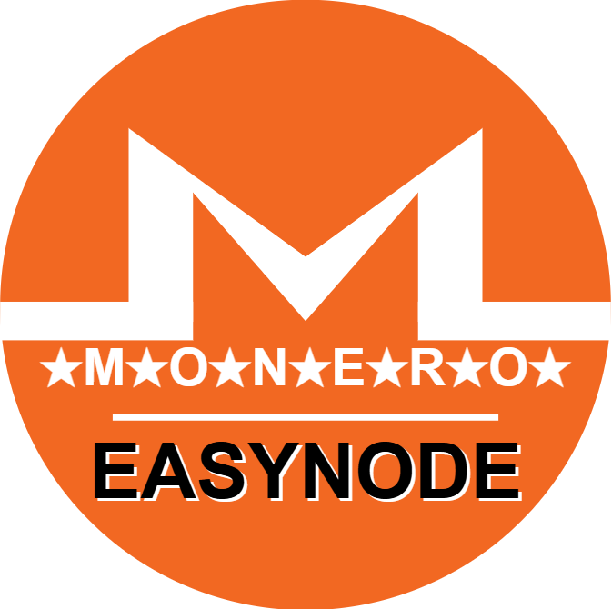
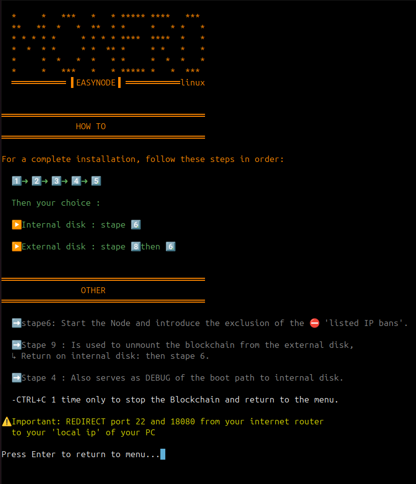

<div align="center">

# 🌟 MONERO EASYNODE 🌟



[](https://github.com/kerlannXmr/Monero_EasyNode/releases)
[](https://github.com/kerlannXmr/Monero_EasyNode)
</div>

## 📥 Téléchargements

<div align="center">

| Version | Lien |
|---------|------|
| 🐧 Linux | [](https://github.com/kerlannXmr/Monero_EasyNode/releases/latest/download/easynode_linux) |
| 🪟 WSL | [](https://github.com/kerlannXmr/Monero_EasyNode/releases/latest/download/easynode_wsl) |

</div>

## 🖥️ Interface:
<div align="center">


</div>


## 📋 Menu Principal

1. Update system
2. Install Monero CLI
3. Install Tor
4. Configure bitmonero
5. Configure anonymous DNS
6. START
7. STOP (ctrl+c)
8. Blockchain on External disk
9. Blockchain on Internal disk
10. Change language
11. FEATURES
12. READ
13. EXIT

## 🚀 Installation

### Pour Linux :
```bash
wget https://github.com/kerlannXmr/Monero_EasyNode/releases/latest/download/easynode_linux
chmod +x easynode_linux
./easynode_linux
```

### Pour Windows (WSL) :
```bash
wget https://github.com/kerlannXmr/Monero_EasyNode/releases/latest/download/easynode_wsl
chmod +x easynode_wsl
./easynode_wsl
```

## ⚡ Fonctionnalités

- ✅ Installation automatisée
- ✅ Configuration de Monero
- ✅ Gestion des disques (interne/externe)
- ✅ Support Tor intégré
- ✅ DNS anonyme
- ✅ Interface utilisateur intuitive

## ⚠️ Important

- REDIRECT port 22 and 18080 from your internet router to your 'local ip' of your PC
- Pour arrêter la Blockchain : CTRL+C (1 fois seulement)

## 🔧 Configuration

### Disque Interne :
- Suivez les étapes 1➡️2➡️3➡️4➡️5
- Puis sélectionnez : Stape 6

### Disque Externe :
- Suivez les étapes 1➡️2➡️3➡️4➡️5
- Puis sélectionnez : Stape 8 puis 6

## 📞 Support

Pour toute question ou assistance :
- Créez une [Issue](https://github.com/kerlannXmr/Monero_EasyNode/issues)
- Consultez la [Documentation](https://github.com/kerlannXmr/Monero_EasyNode/wiki)

<div align="center">

---

Made with ❤️ by [KerlannXmr](https://github.com/kerlannXmr)

</div>
