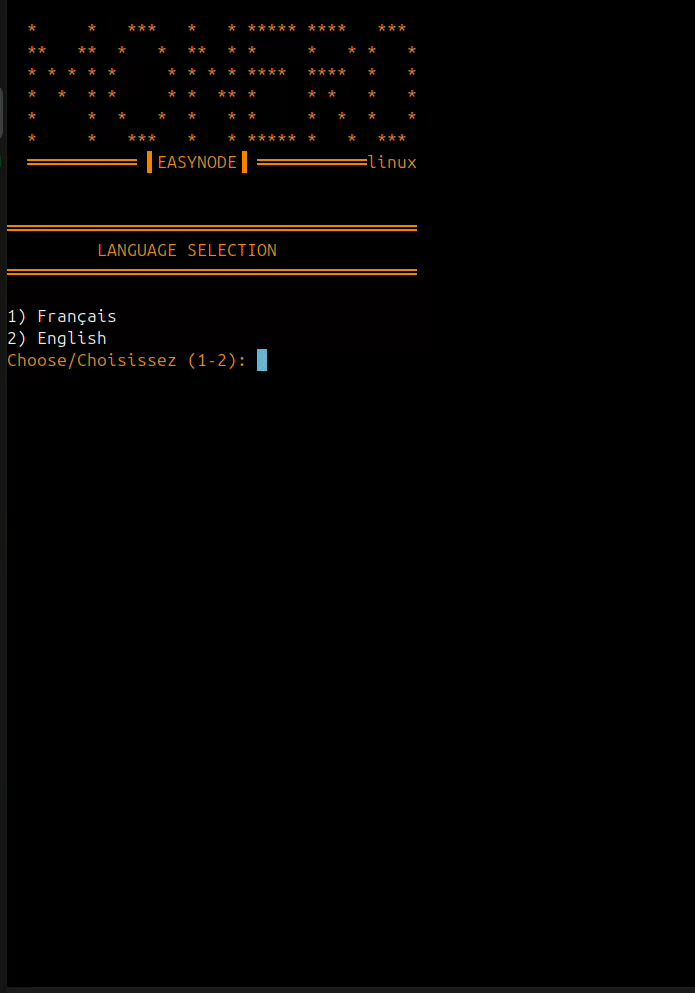
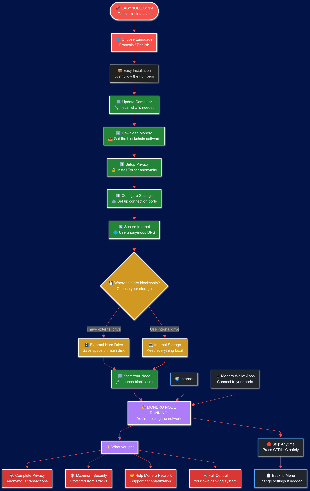

<div align="center">
  <table style="border: 2px solid #FF6600;">
    <tr>
      <td align="center"  width="400">
        <h3>LINUX VERSION</h3>
        <h3>Would you like a Windows version?</h3>
        <h4>See the <a href="https://github.com/kerlannXmr/EasyMonerod/tree/EasyNode-Windows">Windows version</a> of this project</h4>
         <p>🔄change version </p>
  <a href="https://github.com/kerlannXmr/EasyMonerod/tree/EasyNode-Windows">
    
  </a>
  <a href="https://github.com/kerlannXmr/EasyMonerod/">
    
  </a>
      </td>
    </tr>
  </table>
</div>

---

[](mailto:easynode@kerlann.org)
[](https://easynode.kerlann.org/fr.html)
[](https://monero.eco)


<div align="center"></div>

<div align="center">

## Make easy a MONERO Node 


<br>
<br>

[▶️ Demo video](https://mega.nz/file/VnUmELrL#v3_cl436IjI3F5U_LV84rZ9F8Xu1pAP30sUyy5n4YQc) *("Open in new tab")*

</div>

<hr style="border-top: 3px solid orange;">
<b>'EasyNode'</b> simplifies the installation of a <b> 'MONERO node' </b> , allowing you to configure your blockchain in just a few clicks. A complete setup in less than 10 minutes!

Then download its blockchain ⬇️ ...

Finally, start your adventure, you are sovereign...

You can use it in 🐧Linux versions or 🪟 windows  10/11 in wsl version. 

No knowledge required. Select step 1➡️2➡️3➡️4➡️5 and you're done. 
After Boot to your internal drive, 6️⃣, or move the blockchain to your external disk, 8️⃣.

The node is protected by Tor and an onion address allows you to connect to a mobile wallet.
An SSH onion address is available to access the node remotely.
Added the 'MRL' IP bann list of 'boog900'.

🇬🇧 English- 🇫🇷French

Enjoy.

## <div align="center">🖥️ Interface:</div>
<div align="center">
<!---->



  <b> SSH REMOTE:</b>
<br>


<br>
<br>

[](https://mega.nz/file/VnUmELrL#v3_cl436IjI3F5U_LV84rZ9F8Xu1pAP30sUyy5n4YQc) 

<a>right click + "Open in new tab"</a>

 <br>

</div>

## <div align="center">📝 HOW TO</div>

### Internal disk :
- Follow the step 1➡️2➡️3➡️4➡️5
- Then do : Step 6️⃣

### External Disk :
- Follow the step 1➡️2➡️3➡️4➡️5
- Then do : Step 8️⃣ and 6️⃣

## <div align="center">📥 Download:</div>
<div align="center">
  
⇨ 📂 Into path: `/home/$user`
</div>

<div align="center">

| Version | Links |
|---------|------|
| 🐧 Linux | [](https://github.com/kerlannXmr/EasyMonerod/releases/download/v4/easynode_linux.sh) |
| 🪟 WSL | [](https://github.com/kerlannXmr/EasyMonerod/releases/download/v4/easynode_wsl.sh) |
</div>

## <div align="center">🚀 Installation</div>
### 🔒 IP ban_list: (spy, malicius)

◇  Automatic updated 'IP ban-list' in this folder :
-  `/home/$user/.bitmonero`

( Updated: github.com/Boog900/monero-ban-list/blob/main/ban_list.txt )

## 🐧 Linux : Debian, Ubuntu derivatives, Others...

[View issue: Linux installation FR](https://github.com/kerlannXmr/EasyMonerod/issues/7) *(right click + "Open in new tab")*
### ↪️ Download & Install & run script:

- ⚡Beginner users: copy&paste in new terminal

```bash
wget https://github.com/kerlannXmr/EasyMonerod/releases/download/v4/easynode_linux.sh -O easynode_linux.sh && chmod +x easynode_linux.sh && sudo ./easynode_linux.sh
```

- Normal users: copy&paste in new terminal

```bash
sudo wget -P ~ https://github.com/kerlannXmr/EasyMonerod/releases/download/v4/easynode_linux.sh
```
(script goes in folder) " /home/$user "

### ➡️Make it executable

```bash
sudo chmod +x easynode_linux.sh
sudo ./easynode_linux.sh
```
## <div align="center"> ❔ How it Works ❔

<div align="center"></div>


## <div align="center">⚡ Features</div>

## 📋 Essential Features / Fonctionnalités Essentielles

| **Feature / Fonctionnalité** | **🇺🇸 English** | **🇫🇷 Français** | **Details / Détails** |
|-------------------------------|------------------|-------------------|------------------------|
| **🎯 One-Click Installation** | Complete automated setup | Installation complètement automatisée | 13-step guided menu |
| **🛡️ IP Ban Protection** | Auto-blocks malicious nodes | Blocage automatique nœuds malveillants | 3-month bans from github ban-list |
| **🔒 Enhanced Security** | Tor + SSH + IP banning | Tor + SSH + blocage IP | `.onion` addresses generated |
| **💾 Flexible Storage** | Internal/External disk support | Support disque interne/externe | Automatic mounting & UUID config |
| **📊 Real-time Monitoring** | Live peer connections display | Affichage connexions en temps réel | IN/OUT peers with colors |
| **🛡️ Automatic Firewall** | Pre-configured ports & UFW | Ports préconfigurés & UFW | All Monero ports opened |
| **🔧 Zero Configuration** | No Linux expertise needed | Aucune expertise Linux requise | Beginner-friendly interface |
| **🛑 Safe Shutdown Control** | CTRL+C clean blockchain stop | Arrêt propre blockchain CTRL+C | Prevents corruption & returns to menu |
| **⚖️ Blockchain Size Options** | Choose Full (220GB) or Pruned (90GB) | Choix Complète (220Go) ou Pruned (90Go) | Flexible storage requirements |
| **🌐 Anonymous DNS Setup** | Secure DNS auto-configuration | Configuration DNS sécurisés automatique | Privacy-focused DNS servers |

- ✅ Automated installation
- ✅ Disk management (internal/external)
- ✅ Built-in Tor (Tor/SSH onion address)  
- 🔒 Block IP 'ban listed' (MRL) [👉Issue](https://github.com/kerlannXmr/EasyMonerod/issues/3#issue-2871012436)*(right click + "Open in new tab")*          
- 🔒 TOR SSH remote access :  [👉Issue](https://github.com/kerlannXmr/EasyMonerod/issues/2#issue-2870954425)*(right click + "Open in new tab")*                              
- ✅ Intuitive user interface
- ✅ no knowledge required

## <div align="center">⚠️ Important</div>

-➡🟧 REDIRECT port 22 and 18080 from your internet router to your ' local ip ' of your PC.

-18080 allows other Monero nodes to connect to your node, increasing the decentralization and resilience of the network. [👉Issue](https://github.com/kerlannXmr/EasyMonerod/issues/10)

-➡🟧 The external hard drive must be formatted in NTFS (classic) or exFat or ext4.

Because FAT doesn't handle files larger than 4 GB!  [👉Issue](https://github.com/kerlannXmr/EasyMonerod/issues/9)    

-➡📗  Remote access wallet:
  
  Take 'cake wallet', settings, connect and sync, manage nodes, add +, node address= onion Tor, node port= 18081, save. Close and open. Wait the sync.

  or

  Take "Monero Gui", choose "Distant Mode" then " + add new node " and write 'IP local' or 'IP WEB' and port " 18081 "
  
-➡📗  Remote access ssh, port 22:
   
  Open terminal pc or take 'Termux' on android: ' ssh username@local_ip_pc ' . Or ' ssh username@onion_ssh_address '.[👉Issue](https://github.com/kerlannXmr/EasyMonerod/issues11) 
    
-➡🟧 Stop the Blockchain : CTRL+C 

## <div align="center">🔄 Compatibility</div>

<div align="center">
<br>
  
| Distribution | Compatibilité | Notes |
|--------------|---------------|-------|
|      ✅      |       ✅      |     ✅ |

</div>

 **Shell scripts ' EasyNode 'use standard commands that are more portable across different Linux distributions.**
<br>
-➡📗[👉View Issue Distribution compatibility](https://github.com/kerlannXmr/EasyMonerod/issues/8)*(right click + "Open in new tab")*  
<br>
<br>

## <div align="center">🔰 Packages installed by EASYNODE</div>

<br>

- 📝   See the list of packages at this issue [👉PACKAGES list pre-installed ](https://github.com/kerlannXmr/EasyMonerod/issues/6)*(right click + "Open in new tab")*

<br>

## <div align="center">☣️ EasyNode Scripts TEST report</div>

<div align="center">

### Security Scan Results

Audits are performed using VirusTotal and MetaDefender.

| Category | Description | Tools | Status |
|----------|-------------|-------|--------|
| 🔒 Security | Vulnerabilities, malware detection, backdoors | VirusTotal, MetaDefender | ✅ |
| 🐛 Code Issues | Logic flaws, syntax errors, risky patterns | Static Analysis | ✅ |
| 🔍 Behavior | Runtime actions, system modifications, network activity | Dynamic Analysis | ✅ |
| 🔧 Resource Usage | File system access, memory/CPU utilization | MetaDefender | ✅ |
| 📡 Network | Suspicious connections, data exfiltration attempts | VirusTotal | ✅ |
| 💾 File Operations | Dangerous file manipulations, unexpected changes | Both Tools | ✅ |

<br>
  
 <b>Right click + "Open in new tab" to view scann results </b>

| Script | VirusTotal | MetaDefender |
|--------|------------|--------------|
| EasyNode_linux | [](https://www.virustotal.com/gui/url/f647e9bd7a152cab3537fe5130d7b57c6112cec021c73c35403fb6936d0b625c?nocache=1) | [](https://metadefender.com/results/url/aHR0cHM6Ly9naXRodWIuY29tL2tlcmxhbm5YbXIvRWFzeU1vbmVyb2QvcmVsZWFzZXMvZG93bmxvYWQvdjMvZWFzeW5vZGVfbGludXguc2g=) |
| EasyNode_wsl | [](https://www.virustotal.com/gui/url/e1621216f4ef4f9a5a1aa0651d1717b9c4047473d9b040cc047341369df3cb46?nocache=1) | [](https://metadefender.com/results/url/aHR0cHM6Ly9naXRodWIuY29tL2tlcmxhbm5YbXIvRWFzeU1vbmVyb2QvcmVsZWFzZXMvZG93bmxvYWQvdjMvZWFzeW5vZGVfd3NsLnNo) |

</div>

<br>

## 💬  Contact

[](mailto:0595c16adb0e1f467740b5bb4d7e51c8b25042695bc4bd9ebd2e66902720dcbb02)
[](https://matrix.to/#/!diwbZJBzNngFIyfVVh:matrix.org?via=matrix.org)
[](https://simplex.chat/contact#/?v=2-7&smp=smp%3A%2F%2F0YuTwO05YJWS8rkjn9eLJDjQhFKvIYd8d4xG8X1blIU%3D%40smp8.simplex.im%2FhVfnrjb6LGrdWF8dcfEO_3funYfYrCsm%23%2F%3Fv%3D1-3%26dh%3DMCowBQYDK2VuAyEA6eMOBbH4MauXsCWIaZO8r1P7QPCorbwiOSHz0rofgUI%253D%26srv%3Dbeccx4yfxxbvyhqypaavemqurytl6hozr47wfc7uuecacjqdvwpw2xid.onion&data=%7B%22type%22%3A%22group%22%2C%22groupLinkId%22%3A%22IB1UQAdA78A2sbjixkya_g%3D%3D%22%7D)
[](mailto:easynode@kerlann.org)

## ♠️ Support

- 📝 Consult F.A.Q. [👉Questions](https://github.com/kerlannXmr/EasyMonerod/issues/5)*(right click + "Open in new tab")*
- 📝 Consult the [👉Documentation](https://tinyurl.com/kerlann)*(right click + "Open in new tab")*

## 🫶 Thankful

- 🧭 Thanks [👉Monero eco-system](https://monero.eco)*(right click + "Open in new tab")*
- 🇫🇷 Thanks [👉unbanked0](https://github.com/Unbanked0)*(right click + "Open in new tab")*


<div align="center">

---
### Support Development

**If ' EasyNode ' helped you achieve privacy, consider supporting development:**

###  <b>Make donnation with 'cake wallet' to : ' kerlann.xmr '</b>
<div align="center"></div>
or fundraiser

[](https://xmrchat.com/easymonerod)
[](https://kuno.anne.media/fundraiser/dkbu)

---

**🔒 PRIVACY MATTERS 🔒**

*Made with ❤️ for the Monero community*

[⭐ Star this repo](https://github.com/[username]/EasyNode-Tunnels) | [🍴 Fork it](https://github.com/[username]/EasyNode-Tunnels/fork) | [📢 Share it](https://twitter.com/intent/tweet?text=Check%20out%20EasyNode-Tunnels%20-%20Privacy-focused%20Monero%20node%20installer%20with%20Tor%20and%20VPN%20support!&url=https://github.com/[username]/EasyNode-Tunnels)

</div>
<div align="center"></div>
