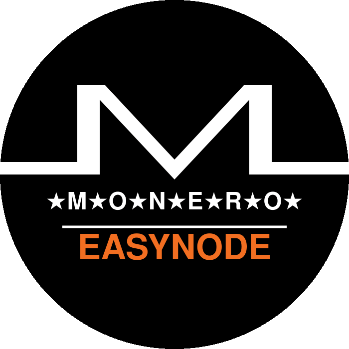
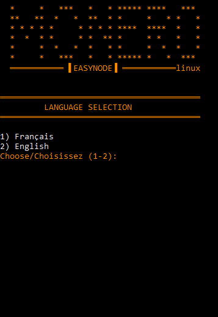
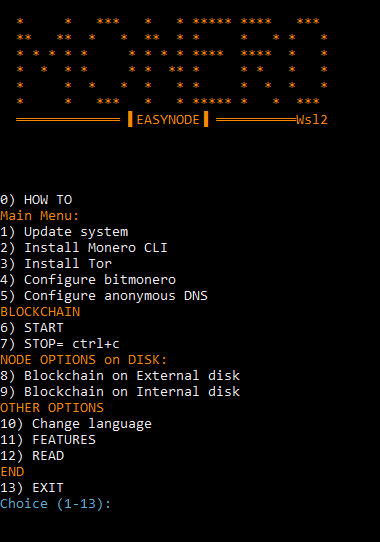
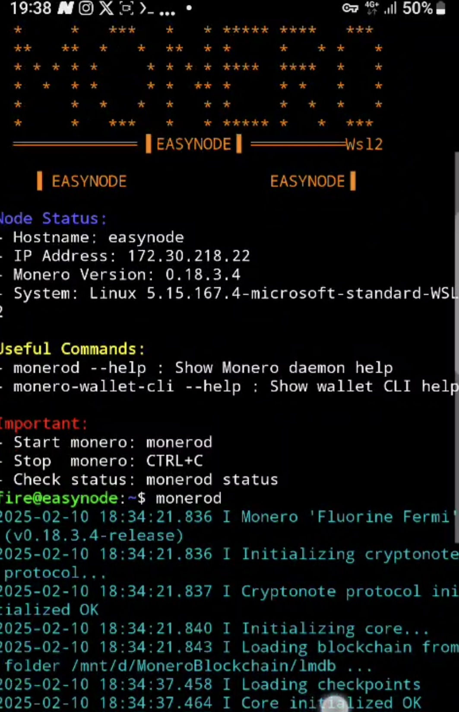

[](https://easynode.kerlann.org)
[](https://easynode.kerlann.org/fr.html)
[](https://monero.eco)

<div align="center"></div>

<div align="center">

## Make easy a MONERO Node 



<br>
<br>

[▶️ Demo video](https://mega.nz/file/5uFzVRKR#w2RehS8LNruoM7A1vxnJPIm3ipjif1EYL_hg4MMoYW0) *("Open in new tab")*

</div>

<hr style="border-top: 3px solid orange;">
<b>'EasyNode'</b> simplifies the installation of a <b> 'MONERO node' </b> , allowing you to configure your blockchain in just a few clicks. A complete setup in less than 10 minutes!

Then download its blockchain ⬇️ ...

Finally, start your adventure, you are sovereign...

You can use it in 🐧Linux versions or 🪟 windows  10/11 in wsl version. 

No knowledge required. Select step 1➡️2➡️3➡️4➡️5 and you're done. 
After Boot to your internal drive, 6️⃣, or move the blockchain to your external disk, 8️⃣.

The node is protected by Tor and an onion address allows you to connect to a mobile wallet.
An SSH onion address is available to access the node remotely.
Added the 'MRL' IP bann list of 'boog900'.

🇬🇧 English- 🇫🇷French language.

Enjoy.

## <div align="center">🖥️ Interface:</div>
<div align="center">
<!---->



  <b> SSH REMOTE:</b>
<br>




<br>
<br>

[](https://mega.nz/file/5uFzVRKR#w2RehS8LNruoM7A1vxnJPIm3ipjif1EYL_hg4MMoYW0) 

<a>right click + "Open in new tab"</a>

 <br>

</div>

## <div align="center">📝 HOW TO</div>

### Internal disk :
- Follow the step 1➡️2➡️3➡️4➡️5
- Then do : Step 6️⃣

### External Disk :
- Follow the step 1➡️2➡️3➡️4➡️5
- Then do : Step 8️⃣ and 6️⃣

## <div align="center">📥 Download:</div>
<div align="center">
  
⇨ 📂 Into path: `/home/$user`
</div>

<div align="center">

| Version | Links |
|---------|------|
| 🐧 Linux | [](https://github.com/kerlannXmr/EasyMonerod/releases/download/v3/easynode_linux.sh) |
| 🪟 WSL | [](https://github.com/kerlannXmr/EasyMonerod/releases/download/v3/easynode_wsl.sh) |
</div>

## <div align="center">🚀 Installation</div>
### 🔒 IP ban_list:

◇  Automatic updated 'IP ban-list' in this folder :
-  `/home/$user/.bitmonero`

( Updated: github.com/Boog900/monero-ban-list/blob/main/ban_list.txt )

## 🐧 Linux :

[View issue: Linux pour débutant FR](https://github.com/kerlannXmr/EasyMonerod/issues/7) *(right click + "Open in new tab")*
### ↪️ Download & Install script: 
/home/$user

```bash
sudo wget -P ~ https://github.com/kerlannXmr/EasyMonerod/releases/download/v3/easynode_linux.sh
```
Make it executable

```bash
sudo chmod +x easynode_linux.sh
sudo ./easynode_linux.sh
```

## 🪟 Windows 10/11 (WSL2) :
### ⚫ 1) Verify WSL2 :

-🔺 Make sure virtualization is enabled in bios: Tape in powershell Administrator :

↳ ` Get-ComputerInfo -Property "HyperV*" ` = True ✅

-🔺 Make sure you already have <b>WSL2</b>:

↳ `wsl --list --verbose` [👉 View issue](https://github.com/kerlannXmr/EasyMonerod/issues/4#issue-2873484919) *(right click + "Open in new tab")*

### ⚫ 2) Install Ubuntu:
-🔷 Go to <b>Microsoft Store</b>, then in search type Ubuntu, click on Ubuntu 24LTS.

Other:

-🔶  <b>In powershell administrator:</b>
```bash
wsl --install
```
learn.microsoft.com/fr-fr/windows/wsl/install

learn.microsoft.com/en-us/windows/wsl/install

### ⚫ 3) Download & Install <b>script</b> : 
/home/$user

```bash
sudo wget -P ~ https://github.com/kerlannXmr/EasyMonerod/releases/download/v3/easynode_wsl.sh
```
Make it executable
```bash
sudo chmod +x easynode_wsl.sh
sudo ./easynode_wsl.sh
```

## <div align="center">⚡ Features</div>

- ✅ Automated installation
- ✅ allow firewall port
- ✅ Monero configuration
- ✅ Disk management (internal/external)
- ✅ Built-in Tor (Tor/SSH onion address)
- ✅ Anonymous DNS
- 🔒 Block IP 'ban listed' (MRL) [👉Issue](https://github.com/kerlannXmr/EasyMonerod/issues/3#issue-2871012436)*(right click + "Open in new tab")*          
- 🔒 TOR SSH remote access :  [👉Issue](https://github.com/kerlannXmr/EasyMonerod/issues/2#issue-2870954425)*(right click + "Open in new tab")*                              
- ✅ Intuitive user interface
- ✅ no knowledge required

## <div align="center">⚠️ Important</div>

-➡🟧 REDIRECT port 22 and 18080 from your internet router to your ' local ip ' of your PC.

-➡🟧 The external hard drive must be formatted in NTFS (classic) or exFat or ext4.
Because FAT doesn't handle files larger than 4 GB!  [👉Issue](https://github.com/kerlannXmr/EasyMonerod/issues/9)*(right click + "Open in new tab")*     

-➡📗  Remote access wallet:
  
  Take 'cake wallet', settings, connect and sync, manage nodes, add +, node address= onion Tor, node port= 18089, save. Close and open. Wait the sync.
  
-➡📗  Remote access ssh:
  
  Open terminal pc or take 'Termux' on android: ' ssh username@local_ip_pc ' . Or ' ssh username@onion_ssh_address '.
  
-➡🟧 Stop the Blockchain : CTRL+C (1 times)

## <div align="center">🔄 Compatibility</div>

<div align="center">
<br>
  
| Distribution | Compatibilité | Notes |
|--------------|---------------|-------|
|      ✅      |       ✅      |     ✅ |

</div>

 **Shell scripts ' EasyNode 'use standard commands that are more portable across different Linux distributions.**
<br>
-➡📗[👉View Issue Distribution compatibility](https://github.com/kerlannXmr/EasyMonerod/issues/8)*(right click + "Open in new tab")*  
<br>
<br>

## <div align="center">🔰 Packages installed by EASYNODE</div>

<br>

- 📝   See the list of packages at this issue [👉PACKAGES list pre-installed ](https://github.com/kerlannXmr/EasyMonerod/issues/6)*(right click + "Open in new tab")*

<br>

## <div align="center">☣️ EasyNode Scripts TEST report</div>

<div align="center">

### Security Scan Results

Audits are performed using VirusTotal and MetaDefender.

| Category | Description | Tools | Status |
|----------|-------------|-------|--------|
| 🔒 Security | Vulnerabilities, malware detection, backdoors | VirusTotal, MetaDefender | ✅ |
| 🐛 Code Issues | Logic flaws, syntax errors, risky patterns | Static Analysis | ✅ |
| 🔍 Behavior | Runtime actions, system modifications, network activity | Dynamic Analysis | ✅ |
| 🔧 Resource Usage | File system access, memory/CPU utilization | MetaDefender | ✅ |
| 📡 Network | Suspicious connections, data exfiltration attempts | VirusTotal | ✅ |
| 💾 File Operations | Dangerous file manipulations, unexpected changes | Both Tools | ✅ |

<br>
  
 <b>Right click + "Open in new tab" to view scann results </b>

| Script | VirusTotal | MetaDefender |
|--------|------------|--------------|
| EasyNode_linux | [](https://www.virustotal.com/gui/url/f647e9bd7a152cab3537fe5130d7b57c6112cec021c73c35403fb6936d0b625c?nocache=1) | [](https://metadefender.com/results/url/aHR0cHM6Ly9naXRodWIuY29tL2tlcmxhbm5YbXIvRWFzeU1vbmVyb2QvcmVsZWFzZXMvZG93bmxvYWQvdjMvZWFzeW5vZGVfbGludXguc2g=) |
| EasyNode_wsl | [](https://www.virustotal.com/gui/url/e1621216f4ef4f9a5a1aa0651d1717b9c4047473d9b040cc047341369df3cb46?nocache=1) | [](https://metadefender.com/results/url/aHR0cHM6Ly9naXRodWIuY29tL2tlcmxhbm5YbXIvRWFzeU1vbmVyb2QvcmVsZWFzZXMvZG93bmxvYWQvdjMvZWFzeW5vZGVfd3NsLnNo) |

</div>

<br>

## ♠️ Support

- 📝 Consult F.A.Q. [👉Questions](https://github.com/kerlannXmr/EasyMonerod/issues/5)*(right click + "Open in new tab")*
- 📝 Consult the [👉Documentation](https://tinyurl.com/kerlann)*(right click + "Open in new tab")*

## 🫶 Thankful

- 🧭 Thanks [👉Monero eco-system](https://monero.eco)*(right click + "Open in new tab")*
- 🇫🇷 Thanks [👉unbanked0](https://github.com/Unbanked0)*(right click + "Open in new tab")*


<div align="center">

---
### 🙏 <b>Make donnation with 'cake wallet' to : ' kerlann.xmr '</b>🙏
<div align="center"></div>
or scann

---


Made with ❤️ by [KerlannXmr](https://github.com/kerlannXmr)

</div>
<div align="center"></div>
