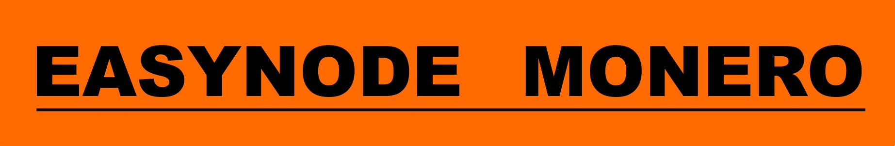
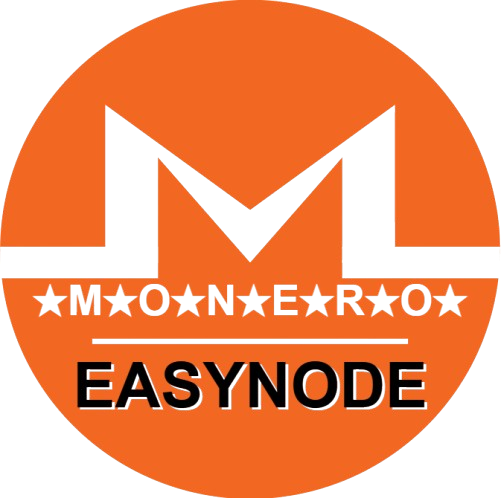

<div align="center">

## Make easy a MONERO Node 


</div>

<hr style="border-top: 3px solid orange;">
<b>'EasyNode'</b> turns installing a <b>'MONERO node'</b> into a quick and easy blockchain process, perform all staps in less than 10 minutes!

Then download its blockchain...

Finally, start your adventure, you are sovereign...

You can use it in 🐧Linux versions or 🪟 windows  10/11 in wsl version. 

No knowledge required. Select step 1,2,3,4,5 and you're done. 
After Boot to your internal drive, 6, or move the blockchain to your external disk, 8.

The node is protected by Tor and an onion address allows you to connect to a mobile wallet.
An SSH onion address is available to access the node remotely.
Added the 'MRL' IP bann list of 'boog900'.

🇬🇧 English- 🇫🇷French language.

Enjoy.


## 📥 Download:

<div align="center">

| Version | Links |
|---------|------|
| 🐧 Linux | [](https://github.com/kerlannXmr/Monero_EasyNode/releases/download/v1.0/easynode_linux.sh) |
| 🪟 WSL | [](https://github.com/kerlannXmr/Monero_EasyNode/releases/download/v1.0/easynode_wsl.sh) |

</div>

## 🖥️ Interface:
<div align="center">


</div>

## 📝 HOW TO

### Internal disk :
- Follow the stap 1➡️2➡️3➡️4➡️5
- Then do : Stap 6

### External Disk :
- Follow the stap 1➡️2➡️3➡️4➡️5
- Then do : Stap 8 and 6

## 🚀 Installation

### 🐧 Linux :
↪️ Download this script, then open a terminal and make it executable:
```bash
wget https://github.com/kerlannXmr/Monero_EasyNode/releases/latest/download/easynode_linux

chmod +x easynode_linux.sh
sudo ./easynode_linux.sh
```

### 🪟 Windows (WSL) :
WSL Ubuntu in widows 10/11:

-🔺 Make sure virtualization is enabled in bios: Tape in powershell Administrator :

` Get-ComputerInfo -Property "HyperV*" ` = True ✅

-🔹 Go to Microsoft Store, then in search type Ubuntu, click on Ubuntu 24LTS.

Other:

-🔸 In powershell administrator:
```bash
wsl --install
```
learn.microsoft.com/fr-fr/windows/wsl/install

learn.microsoft.com/en-us/windows/wsl/install

 ↪️ Download this script, open a terminal and make it executable:
```bash
wget https://github.com/kerlannXmr/Monero_EasyNode/releases/latest/download/easynode_wsl

chmod +x easynode_wsl.sh
sudo ./easynode_wsl.sh
```

## ⚡ Features

- ✅ Automated installation
- ✅ allow firewall port
- ✅ Monero configuration
- ✅ Disk management (internal/external)
- ✅ Built-in Tor (Tor/SSH onion address)
- ✅ Anonymous DNS
- ✅ Block IP 'ban listed' (MRL)
- ✅ SSH remote access
- ✅ Intuitive user interface
- ✅ no knowledge required

## ⚠️ Important

-➡🟧 REDIRECT port 22 and 18080 from your internet router to your ' local ip ' of your PC.

-➡📗  Remote access wallet:
  
  Take 'cake wallet', settings, connect and sync, manage nodes, add +, node address= onion Tor, node port= 18089, save. Close and open. Wait the sync.
  
-➡📗  Remote access ssh:
  
  Open terminal pc or take 'Termux' on android: ' ssh username@local_ip_pc ' . Or ' ssh username@onion_ssh_address '.
  
-➡🟧 Stop the Blockchain : CTRL+C (1 times)

## 🔄 Compatibility
| Distribution | Compatibilité | Notes |
|--------------|---------------|--------|
| Debian | ✅ | Distribution de base |
| Ubuntu et dérivés |✅||
| Lubuntu | ✅ | LXDE/LXQt |
| Kubuntu | ✅ | KDE |
| Xubuntu | ✅ | XFCE |
| Ubuntu Budgie | ✅ | Budgie |
| Ubuntu MATE | ✅ | MATE |
| Ubuntu Studio | ✅ | Multimédia |
| Mint et dérivés |✅||
| Linux Mint | ✅ | Basé sur Ubuntu |
| LMDE | ✅ | Basé sur Debian |
| Tails |✅ | Nécessite configuration supplémentaire |
| Parrot OS | ✅ | OS Sécurisé |
| PureOS | ✅ | OS Sécurisé |
| Kali Linux | ✅ | OS Sécurisé |
| BackBox | ✅ | OS Sécurisé |
| Fedora |❌||
| SUSE |❌ ||
| Gnome | ✅ | Environment de bureau |
| KDE Plasma | ✅ | Environment de bureau |
| Linux Lite | ✅ | Léger |
| Gentoo |❌ ||
| Elementary OS | ✅ | Basé sur Ubuntu |
| MX Linux | ✅ | Basé sur Debian |
| Zorin OS | ✅ | Basé sur Ubuntu |
| AntiX | ✅ | Léger |
| Bodhi Linux | ✅ | Léger |
| Deepin | ✅ | Basé sur Debian |
| KDE neon | ✅ | Basé sur Ubuntu |
| Voyager | ✅ | Basé sur Debian |
| Watttos | ✅ | Basé sur Debian |
|Arch Linux |❌ ||

These distributions must be 64-bit, as the script is designed for x86_64 architecture.


## 🔰 Pakages installed by EASYNODE

| Category | Packages | Description |
|----------|----------|-------------|
| **System Tools** | build-essential | Compilation and build tools |
| | software-properties-common | APT repository management |
| | apt-transport-https | HTTPS support for APT |
| | curl | Data transfer tool |
| | wget | File download utility |
| | git | Version control system |
| | gnupg | Encryption and signing |
| | lsb-release | Distribution information |
| **Compression** | bzip2 | bzip2 compression |
| | libbz2-dev | bzip2 libraries |
| | zip | ZIP compression |
| | unzip | ZIP decompression |
| | tar | TAR archiving |
| | gzip | GZIP compression |
| **Network** | net-tools | Basic network tools |
| | openssh-server | SSH server |
| | ufw | Simple firewall |
| | fail2ban | Protection against attacks |
| | nmap | Port scanner |
| | tcpdump | Packet analyzer |
| | htop | Process monitor |
| | iftop | Bandwidth monitor |
| | iotop | I/O monitor |
| **Python** | python3 | Python 3 interpreter |
| | python3-pip | Python package manager |
| | python3-dev | Python headers and libs |
| **Editors** | vim | Advanced text editor |
| | nano | Simple text editor |

## ♠️ Support
- getmonero.dev
- Consult the [Documentation](https://tinyurl.com/kerlann)

<div align="center">

---
🙏 <b>Make donnation with 'cake wallet' to : ' kerlann.xmr '</b>🙏
---
Made with ❤️ by [KerlannXmr](https://github.com/kerlannXmr)

</div>
